```mermaid
flowchart TD
    A[🐍 Python Basics] --> B[📚  Full-Stack Web Development]
    B --> C[⚛️ React Mastery]
    B --> D[🔧 Node.js Backend]
    B --> E[📱 Modern JavaScript]
    C --> F[🌐 Full-Stack Projects]
    D --> F
    E --> F
    F --> G[🚀 Web3 Development]
    F --> H[💼 Business Solutions]
    
    style A fill:#4ecdc4,color:#fff
    style B fill:#45b7d1,color:#fff
    style C fill:#61dafb,color:#000
    style D fill:#68a063,color:#fff
    style E fill:#f7df1e,color:#000
    style F fill:#96ceb4,color:#fff
    style G fill:#627eea,color:#fff
    style H fill:#feca57,color:#000
```

# <div align="center"></div>

<div align="center">
  
</div>

<div align="center">
  
  
  
  
</div>

---

##  **About Me**


🎓 **Software Engineering Student** passionate about creating impactful web solutions  
🚀 **Currently Building:** Fitness Center Website (University Project)  
📚 **Active Learning:**  
   - 🐍 **Python Basics Course** (In Progress)  
   - 📋 **Udemy Full-Stack Course** (Starting Soon)  
   - 🌐 **Modern Web Technologies** preparation  

🎯 **Mission:** Building ANY website I want with the latest technologies  
🔮 **Vision:** Becoming a versatile full-stack developer ready for startups & business solutions  
📧 **Let's Connect:** [namindudinusd@gmail.com](mailto:namindudinusd@gmail.com)

---

##  **Tech Stack & Learning Journey**

<div align="center">

### **Current Skills**
<p>
  
</p>

### **Currently Learning**
<p>
  
  
</p>

### **Next: Full-Stack Technologies **
<p>
  
</p>

### **Future Learning Path**
<p>
  
  
</p>

### **Tools & Design**
<p>
  
</p>

</div>

---

##  **Learning Roadmap 2024**



---

##  **What I'm Building Towards**

<div align="center">

| 🎯 **Goals** | 📋 **Status** | 
|-------------|---------------|
| **Master Python Fundamentals** | 🟡 In Progress | 
| **Complete Udemy Full-Stack Course** | 🔄 Starting Soon | 
| **Build React Frontend Projects** | ⏳ Planned |
| **Master Node.js Backend** | ⏳ Planned | 
| **Learn Professional Best Practices** | ⏳ Planned |
| **Develop Web3 Applications** | ⏳ Future | 
| **Create Business-Ready Solutions** | ⏳ Future | 

</div>

---

##  **Course Curriculum Preview**

<details>
<summary><b>🎓 Udemy Full-Stack Development Course</b></summary>

### **Frontend Mastery**
- ⚛️ **React Development** - Component-based architecture
- 🎨 **Modern JavaScript** - ES6+ features and best practices
- 📱 **Responsive Design** - Mobile-first approach
- 🛠️ **Development Tools** - Professional workflow setup

### **Backend Excellence**
- 🔧 **Node.js** - Server-side JavaScript mastery
- 🗄️ **Database Integration** - MongoDB and SQL databases
- 🔐 **Authentication & Security** - User management systems
- 📡 **API Development** - RESTful services and GraphQL

### **Advanced Topics**
- 🌐 **Web3 Development** - Blockchain and DApps
- ☁️ **Deployment Strategies** - Cloud platforms and DevOps
- 🧪 **Testing & Debugging** - Quality assurance practices
- 📈 **Performance Optimization** - Speed and scalability

</details>

---

##  **GitHub Analytics**

<div align="center">
  
  
</div>

<div align="center">
  
</div>

---

##  **Activity Graph**

<div align="center">
  
</div>

---

##  **2025 Learning Milestones**

<div align="center">

```text
📚 Python Basics Course           ████████░░ 80% Complete
🎓 Udemy Full-Stack Prep          ██░░░░░░░░ 20% Complete
⚛️ React Frontend Skills          ░░░░░░░░░░  0% Complete
🔧 Node.js Backend Skills         ░░░░░░░░░░  0% Complete
🌐 Web3 Development               ░░░░░░░░░░  0% Complete
```

</div>

---

##  **Let's Connect & Build Together**

<div align="center">

[](mailto:namindudinusd@gmail.com)
[](#)
[](#)
[](#)

</div>

<div align="center">

**💡 Open to collaborations on:**
- 🌐 Full-Stack Web Projects
- 🐍 Python Learning Projects  
- 🎯 University Assignment Help
- 🚀 Startup Ideas & MVPs

</div>

---

<div align="center">
  
</div>

<div align="center">
  
</div>

**<div align="center">⭐ From [namindu-dinu](https://github.com/namindu-dinu) | Journey from Python to Full-Stack 🚀</div>**
